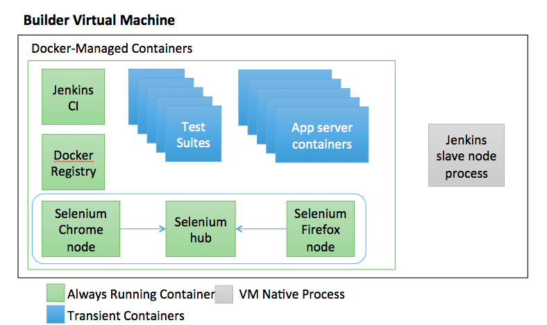

# Continuous Integration Demo
### CANARIE Research Software Developer Workshop
#### May 2016

This directory contains a [Vagrant](https://www.vagrantup.com/) file that demonstrates a Continuous Integration server mentioned during the CANARIE 2016 Research Software Developer Workshop.  This server demonstrates basic docker based web page testing using python based Selenium tests.

## Usage
To run, execute the following from this directory (the directory containing the project Vagrantfile).

	./onetime.sh
	vagrant up cidemo

	open http://localhost:18080

## VM Architecture

## Required Software
The following software packages are needed to run this project:

* [Vagrant 1.8.1](https://www.vagrantup.com/downloads.html)
* [Virtualbox](https://www.virtualbox.org/wiki/Downloads)
